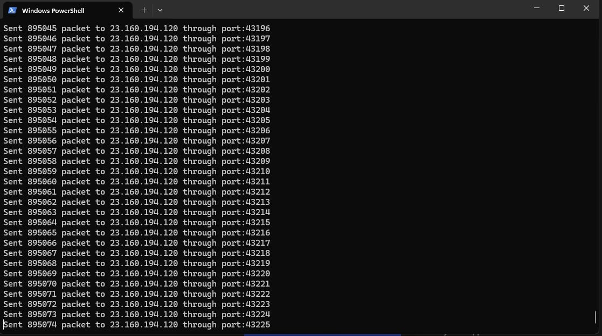

# DDos-Attack

## What Is A DDos-Attack

A Distributed Denial of Service (DDoS) attack is an attempt to make an online service unavailable by overwhelming it with traffic from multiple sources. They target a wide variety of important resources from banks to news websites, and present a major challenge to making sure people can publish and access important information.

## Download & Install

```sh
git clone https://github.com/Prarambha369/DDos-Attack
```
```sh
cd DDos-Attack!
```
```sh
chmod +x ddos-attack.py
```
```sh   
python ddos-attack.py
```
## Usage

1. Run the script:
    ```sh
    python ddos-attack.py
    ```
2. Enter the target IP address and port when prompted.
3. The script will start sending a flood of requests to the target IP address.
4. To stop the attack, press `Ctrl + C`.

## Disclaimer
This tool is for educational purposes only. Use it responsibly and do not use it to attack any website without permission. Unauthorized use of this tool is illegal and unethical. The target website will be down for a while. Use this tool responsibly and do not use it to attack any website without permission. Unauthorized use of this tool is illegal and unethical. The author is not responsible for any misuse of this tool. Use it at your own risk. Enjoy!

## Author

MrBashyal

GitHub: [Prarambha369](https://github.com/Prarambha369)

## ScreenShot

